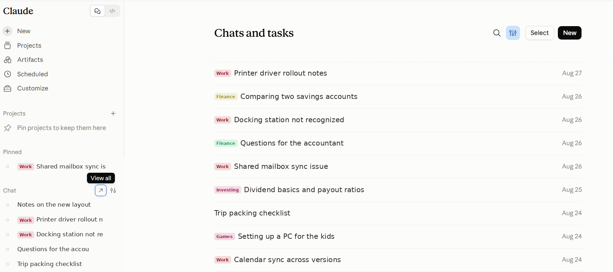

# Claude project badges

A userscript that shows which project each conversation belongs to, right in the chat list.

Claude.ai lists your chats and tasks without saying which project they came from, so a long list of titles gives you no way to tell work from side projects at a glance. This adds a small coloured pill in front of each title — in the sidebar, the "Chats and tasks" list, and anywhere else a chat is linked.

Each project gets its own colour, derived from a hash of its name, so the same project always looks the same.

## Install

1. Install [Violentmonkey](https://violentmonkey.github.io/) or [Tampermonkey](https://www.tampermonkey.net/).
2. In Chrome, open `chrome://extensions`, click **Details** on the extension, and turn on **Allow User Scripts**. Nothing will run without this. Older builds need **Developer mode** switched on first. Firefox doesn't need either.
3. Open the extension, create a new script, and paste in the contents of [`claude-project-badges.user.js`](claude-project-badges.user.js).
4. Save, then reload claude.ai.

You can also drag the `.user.js` file into a browser tab to get an install prompt. Keep the `.user.js` ending on the filename or the installer won't trigger, and in Chrome enable "Allow access to file URLs" for the extension.

## How it works

On load the script reads your project list and conversation list from claude.ai's own API using your existing session, then builds a map of conversation ID to project name. A `MutationObserver` watches the page and labels any link to `/chat/<uuid>` as the app renders it.

Two details that took some finding:

- The main chat list uses a stretched overlay link that covers the row but holds no text of its own, while sidebar links wrap their title directly. The script handles both by climbing to the row container when the link itself is empty, then picking the longest run of text in the row — the title, never the "4 days ago" timestamp.
- The app re-renders rows and discards the injected badge, so the script checks whether the badge is still on the page rather than remembering that it added one. Marking a row as done and moving on means the badge disappears on the first re-render and never returns.

Nothing is sent anywhere. All requests go to claude.ai, same as the page itself.

## Configuration

Options live in the `CFG` block at the top of the script.

| Option | Default | What it does |
| --- | --- | --- |
| `showUnfiled` | `false` | Also badge chats with no project, with a grey "no project" pill |
| `refreshMs` | `300000` | How often to re-pull the conversation list, in ms |
| `pageSize` | `200` | Conversations per API request |
| `maxPages` | `15` | Cap on pages fetched, so around 3000 conversations |
| `missGraceMs` | `20000` | Minimum gap between refetches when an unrecognised chat appears |
| `debug` | `false` | Show the diagnostic panel described below |

## When badges stop appearing

Claude.ai's markup and API shapes change from time to time. Set `debug: true`, save, and reload — a panel appears in the bottom right with how many chat links were found, how many were badged, how many had no usable title, and the tag and class chain of one row.

- `convos: 0` means the API call failed or its response shape changed. Check the `error` line.
- `links` high but `badged: 0` means the DOM changed and the title lookup needs updating.
- `noTitle` high means rows are structured differently than the climb expects.

The panel is designed to be readable without devtools, which are locked down in some managed browsers.

## Limitations

- Tasks are only labelled if the task row links to its conversation.
- Project colours come from a name hash, so two projects can land on similar hues. Rename one, or set an explicit hue in `hue()`.
- Relies on undocumented internal endpoints. It can break after any claude.ai update.

## License

MIT. Not affiliated with, endorsed by, or supported by Anthropic.
